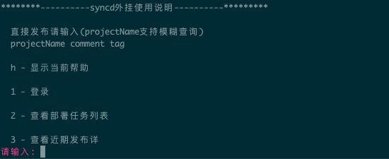

##Syncd-console（syncd命令行插件）

## Preview




## Install
````
git clone https://github.com/murderxchip/syncd-console.git
cd syncd-console
make
./bin/scd
````

## add ~/bin to your environment PATH:
````
export PATH=YOURPATH:$PATH
````

## Configuration 
* vim ~/.syncd-console.ini 
(可不配置，第一次运行程序按向导提示将自动完成)
```
schema = http
host = <<your syncd host>>
username = <<username>>
password = <<password>>
```

## deploy project
```
d projectName comment tag 
eg:d test-project testDeploy develop
```

## Usage
```
./bin/scd -h

d(deploy) - 发布项目(d projectName comment tag) eg:d test-project testDeploy develop
? - 显示当前帮助
l(login) - 登录
t(task) - 查看部署任务列表
h(history) - 查看近期发布详情
```

## Author: 
```
7853151@qq.com 
xu_jw@foxmail.com
```